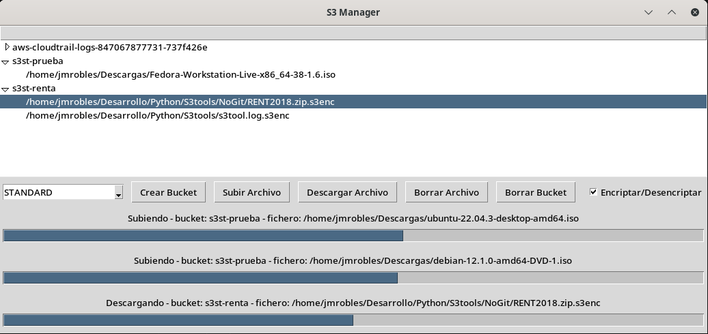

# S3tools

## Rationale for S3tools

Let's face it, all this IT stuff is about managing information. Information is the raw material and the product of computing processes.

One of the most important tasks in managing information is to prevent its loss. This is not something that has emerged with computers. There have always been archives and there have always been disasters, natural (floods, fires, earthquakes) or man-made (theft, wars, deliberate destruction), which have caused their loss or deterioration. I don't think I'm wrong in saying that now, with digitized information, the likelihood of loss or deterioration is much higher.

There have been more or less automated backup systems since the birth of computing. These backup systems generally transfer information to long-lasting media (in some cases, such as CDs or DVDs, not so long-lasting). These media can be vulnerable, so in a backup plan, it is normal to establish that the media must be periodically stored in cabinets specially prepared to withstand disaster situations and also in locations different from where the computer system normally resides.

Backup systems have their costs, and so do the media. Furthermore, we must bear in mind that they are not infallible; they have a certain level of availability.

An alternative to physical media is cloud storage. Almost all cloud providers offer storage systems, some with a free tier, but generally, when the data occupies several tens of GB (or more), a monthly, quarterly, or annual fee must be paid that depends on many factors (read access frequency, speed, size, etc.).

The cheapest storage is usually for data that would only be recovered in case of disaster. These are documents, photos, videos that we keep at home on external drives, SSDs, optical discs, and/or NAS devices that, due to their objective or subjective importance, we do not want to lose in any way. For this type of data, providers such as Amazon AWS or Microsoft Azure offer similar services (around one-thousandth of a US dollar per GB per month for storage, although recovery could cost two cents per GB, all with eleven nines 99.9999999% availability). Storing, for example, 200 GB for 10 years could cost $24, much less than any solution we could implement that would not have, by far, that availability (external drives, tapes, SSD cards, etc.).

The S3tools package includes utilities for using Amazon's S3 storage. You can create, list, delete, etc., "buckets" (Amazon storage resources) and upload or download files from those "buckets". In this type of storage, rather than talking about file systems, we should talk about objects. An object is a bag of bytes that has a certain name (which can be a path in a Windows or UNIX file system). Buckets can be created with different storage classes, each with its own characteristics and cost. 

While the largest individual objects that can be stored in Amazon AWS are 5 TB, if the files are larger than 5 GB, they must be uploaded in parts. S3tools follows Amazon's recommendation to use multipart upload or download with fragments of up to 100 MB.

To avoid suspicions (providers must respect their privacy commitments, but no one is perfect), it adds encryption and decryption functions.

Command line utilities have been included in both Bash and Python, and there is even a simple graphical interface for Python.

## Requirements

### General

- Amazon account with permissions to manage S3 buckets.

### Python

- Python interpreter with version >= 3.9 with module venv and tk

## #Bash scripts

- Bash interpreter
- openssl
- aws CLI utility in working order

## Installation

### Download sources

1. Clone repository
    ```
    git clone https://github.com/pulijon/S3tools
    ```
1. Change to the directory created
   ```bash
   cd S3tools
   ```

### Install Python requirements in virtual environment

1. Create a virtual environment .venv (this name can be whatever the user choose)
    ```bash
    $ python -m venv .venv
    ```
1. Install the requirements
    ```
    $ pip install -r requirements.txt
    ```

## Usage

### Python

#### CLI version s3tool.py

**s3tool.py** includes an autodescriptive help with the -h option

```bash
$ python s3tool.py -h
usage: s3tool.py [-h] [-f FNAME] [-b BUCKET] [-k ENV_CRYPT_KEY] [-o OUTPUT_FNAME] [-r REGION]
                 [-s {STANDARD,INTELLIGENT_TIERING,STANDARD_IA,ONEZONE_IA,GLACIER,GLACIER_IR,DEEP_ARCHIVE,REDUCED_REDUNDANCY}]
                 {create,upload,download,list_buckets,list_files,delete_file,delete_bucket,encrypt,decrypt}

positional arguments:
  {create,upload,download,list_buckets,list_files,delete_file,delete_bucket,encrypt,decrypt}
                        operación a realizar. Por defecto, list_buckets

options:
  -h, --help            show this help message and exit
  -f FNAME, --fname FNAME
                        archivo a procesar
  -b BUCKET, --bucket BUCKET
                        modelo a utilizar. Por defecto, default-vault
  -k ENV_CRYPT_KEY, --env-crypt-key ENV_CRYPT_KEY
                        variable de entorno con la clave de encriptación. Por defecto, S3_CRYPT_KEY
  -o OUTPUT_FNAME, --output-fname OUTPUT_FNAME
                        fichero resultado
  -r REGION, --region REGION
                        region. Por defecto, us-east-2
  -s {STANDARD,INTELLIGENT_TIERING,STANDARD_IA,ONEZONE_IA,GLACIER,GLACIER_IR,DEEP_ARCHIVE,REDUCED_REDUNDANCY}, --storage-class {STANDARD,INTELLIGENT_TIERING,STANDARD_IA,ONEZONE_IA,GLACIER,GLACIER_IR,DEEP_ARCHIVE,REDUCED_REDUNDANCY}
                        clase de almacenamiento. Por defecto, STANDARD

```

#### GUI version

Execute

```bash
python s3gui.py
```

### Bash scripts

#### s3list.bash

```bash
./s3list [bucket]
```

Without arguments, lists all the bucket in the account, is the name of a bucket is provided, shows its content.

#### s3up.bash

```bash
./s3up.bash <bucket> <file> [stclass]
```

It encrypts **file** and uploads the encrypted file (with the **.s3c** extension) to **bucket**. If **bucket** did not exist, it creates it with the storage class stclass that can be one of the following:

- STANDARD (default storage class)
- INTELLIGENT_TIERING
- STANDARD_IA
- ONEZONE_IA
- GLACIER
- GLACIER_IR
- DEEP_ARCHIVE
- REDUCED_REDUNDANCY

The encrypt algorythm is AES, the key must be contained in the environment variable S3_CRYPT_KEY

It makes use of multipart upload for file sizes greater than 100 MB

#### s3down.bash

```bash
./s3down.bash <bucket> <file>
```

It downloads **file** (it does not encrypt nor decrypt **file**) from the **bucket**

#### s3rm.bash

```bash
./s3down.bash <bucket> [object]
```

If **object** is provided, it removes **object** from **bucket**, else, remove **bucket**

#### s3decrypt.bash

```bash
./s3decrypt.bash <encfile> <decfile>
```

It decrypts **encfile** saving the decrypted version in **decfile**

## Screenshots



